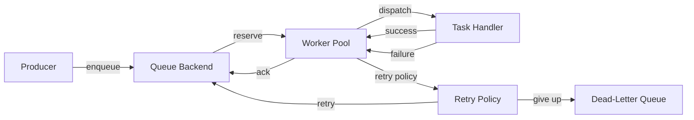

# Architecture

## Overview

taskq-rs is a distributed async task queue written in Rust. It explores a common systems problem: how do you reliably process work across multiple workers when any part of the system can fail?

Task queues sit between the part of a system that produces work and the part that executes it. A web server might enqueue a "send welcome email" task rather than sending it inline, keeping request latency low and letting a separate worker pool handle the slow operation. The queue provides durability — if a worker crashes, the task is not lost — and concurrency control, so the system can process many tasks in parallel without overwhelming downstream services.

This project uses that problem as a vehicle to explore async Rust, Tokio, trait-based abstraction, and the practical reliability concerns that come up in production backend systems.

## Goals

- **Reliability first.** Tasks should not be silently lost. Failures should be retried. Poison messages should be isolated. The system should shut down cleanly.
- **Clear architecture.** Domain types, storage backends, retry logic, and worker orchestration live in separate crates with well-defined interfaces. Each component should be understandable in isolation.
- **Learning through building.** This project is a deliberate exploration of async Rust patterns — trait objects, cancellation safety, bounded concurrency, graceful shutdown — in a realistic context.

## Non-Goals

- **Exactly-once delivery.** The system targets at-least-once semantics. Exactly-once requires coordination (transactions, idempotency keys, deduplication) that adds significant complexity. Handlers are expected to be idempotent.
- **Massive scale.** This is not designed to compete with Kafka or SQS. The focus is on correctness and clarity, not throughput benchmarks.
- **Multi-tenancy or authentication.** There is no concept of users, permissions, or isolated namespaces.
- **Production deployment tooling.** No Kubernetes manifests, Docker images, or cloud infrastructure.

## High-Level Architecture

The system is split into three layers, each in its own crate:

**`taskq-core`** defines the domain. It contains the `Task` model, error types, and the trait interfaces (`QueueBackend`, `TaskHandler`, `RetryPolicy`) that the other crates program against. It has no runtime dependencies — no Tokio, no I/O. This is intentional: the domain layer is pure data and contracts.

**`taskq-runtime`** owns execution. It will contain the worker pool that polls a backend for tasks, dispatches them to handlers, and coordinates retries, dead-lettering, and shutdown. It depends on `taskq-core` for types and on Tokio for async execution.

**Backend crates** (`taskq-backend-memory`, and later `taskq-backend-redis`) implement the `QueueBackend` trait. Each one handles storage and retrieval of tasks using a different technology. The runtime does not know or care which backend it talks to — it operates through the trait.

This separation means you can swap backends without touching the worker pool, change retry logic without touching storage, or test the full pipeline with an in-memory backend that requires no external services.

## Core Concepts

**Task** — A unit of work. Carries an opaque byte payload, a queue name for routing, metadata for headers and trace context, and bookkeeping fields (attempt count, status, timestamps). Tasks are identified by a type-safe `TaskId` wrapping a UUID.

**Worker** — A Tokio task that loops: reserve a task from the backend, pass it to a handler, then ack or nack based on the result. Multiple workers run concurrently in a pool with bounded concurrency.

**Queue backend** — The storage layer. Responsible for persisting tasks, handing them out to workers (reservation), and tracking their state. The `QueueBackend` trait defines five operations: `enqueue`, `reserve`, `ack`, `nack`, and `move_to_dlq`.

**Retry policy** — A pure function that looks at a failed task (particularly its attempt count and max attempts) and decides: retry after a delay, or give up and dead-letter it. Implemented as the sync `RetryPolicy` trait, separate from the backend and runtime so that retry logic is testable without I/O.

**Dead-letter queue (DLQ)** — Where tasks go after exhausting their retries. The DLQ isolates poison messages so they stop blocking the main queue. Tasks in the DLQ can be inspected, replayed, or discarded manually.

## Task Lifecycle

A task moves through a simple state machine:

```
Pending ──reserve──> Active ──ack──> Completed
                       |
                      nack
                       |
                       v
                     Failed
                       |
               retry policy evaluates
                     /    \
                    v      v
              Pending    DeadLettered
            (re-enqueue)
```

**Happy path:** A producer calls `enqueue`. The task enters `Pending` state. A worker calls `reserve`, which atomically moves it to `Active`. The handler runs. On success, the worker calls `ack`, moving it to `Completed`.

**Failure path:** If the handler returns an error, the worker calls `nack`. The runtime consults the `RetryPolicy`. If retries remain, the task goes back to `Pending` with an incremented attempt counter and a backoff delay. If retries are exhausted, `move_to_dlq` is called, and the task enters `DeadLettered`.

## Reliability Model

**At-least-once delivery.** A task is only removed from the queue after an explicit `ack`. If a worker crashes mid-processing, the task remains `Active` and can be reclaimed after its visibility deadline expires. This means a task might be delivered more than once — handlers must tolerate duplicates.

**Retry with exponential backoff.** The `RetryPolicy` trait allows configurable backoff strategies. A typical implementation doubles the delay on each attempt (e.g., 1s, 2s, 4s, 8s) with optional jitter to avoid thundering herds. The policy is a pure function of the task state, making it easy to test deterministically.

**Dead-letter queue.** After `max_attempts` failures, a task is moved to the DLQ rather than retried forever. This prevents a single bad message from consuming worker capacity indefinitely. The DLQ is a logical concept managed by the backend — it could be a separate queue, a status flag, or a different storage location depending on the implementation.

## Backpressure Strategy

Unbounded queues eventually run out of memory. The system addresses this at multiple levels:

- **Bounded worker concurrency.** The worker pool runs a fixed number of workers. This caps how many tasks are in-flight at once, which limits memory usage, downstream load, and the blast radius of failures.
- **Bounded queue capacity.** Backends can enforce a maximum queue depth. When a queue is full, `enqueue` returns `QueueError::QueueFull`, giving the producer a clear signal to slow down or shed load.
- **Poll throttling.** When `reserve` returns `None` (empty queue), workers back off rather than busy-looping.

The goal is that every buffer in the system has a bound, so load increases degrade performance gracefully rather than causing cascading failures.

## Future Extensions

- **Redis backend** — Durable storage using Redis lists and sorted sets, enabling multi-process worker pools and persistence across restarts.
- **Observability** — Structured tracing spans around enqueue/reserve/ack operations, metrics for queue depth, processing latency, retry rates, and DLQ counts.
- **Visibility timeout** — A deadline on reserved tasks. If a worker does not ack before the deadline, the task becomes available for another worker. Prevents stuck tasks from blocking the queue.
- **Leader election** — A coordination mechanism so that only one node runs periodic maintenance tasks like reclaiming expired leases.
- **Additional backends** — NATS JetStream or other messaging systems, demonstrating that the trait abstraction holds up across fundamentally different storage models.

## System Diagram


